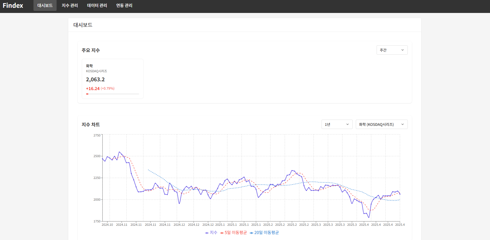

# Findex


- 가볍고 빠른 외부 API 연동 금융 분석 도구
- 금융 지수 데이터를 한눈에 제공하는 대시보드 서비스
- 프로젝트 기간: 2025.04.21 ~ 2025.04.29

(팀 협업 문서 링크 게시)

---

## 팀원 구성

김창환 (개인 Github 링크)   
박상혁 (https://github.com/manleKim)   
이영인 (https://github.com/ddday366)  
이종원 (https://github.com/BrotherMountain)  
최성현 (https://github.com/hakSick)

---

## 기술 스택

- Backend: Spring Boot, Spring Data JPA, Spring Scheduler, Lombok, MapStruct, Validation
- Database: PostgreSQL
- 공통 Tool: Git & Github, Discord, Notion

---

## **팀원별 구현 기능 상세**

### **김창환**

- **지수 정보 컨트롤러**
    - 등록, 수정, 삭제, 조회 API 매핑
- **지수 데이터 컨트롤러**
    - 등록, 수정, 삭제, 조회, Export API 매핑 및 요청 파라미터 처리
- **연동 작업 컨트롤러**
    - 수동 연동 실행 및 연동 작업 이력 조회 API 매핑
- **자동 연동 설정 컨트롤러**
    - 자동 연동 등록, 수정, 목록 조회 API 매핑

---

### **박상혁**


- **지수 정보 연동 API**
    - Open API를 응용하여 지수 정보 등록/수정
    - 사용자 직접 연동 기능 및 결과 기록
- **지수 데이터 연동 API**
    - `{지수}`, `{대상 날짜}` 조건으로 Open API를 통해 데이터 등록/수정
    - 사용자 직접 연동 기능 및 이력 관리
- **연동 작업 목록 조회 API**
    - `{유형}`, `{지수}`, `{대상 날짜}`, `{작업자}`, `{결과}`, `{작업일시}` 기준 검색 및 조회
    - `{대상 날짜}`, `{작업일시}` 정렬 및 페이지네이션

---

### **이영인**


- **지수 정보 등록 API**
    - `{지수 분류명}`, `{지수명}`, `{채용 종목 수}`, `{기준 시점}`, `{기준 지수}`, `{즐겨찾기}` 등록
    - `{지수 분류명}`, `{지수명}` 중복 방지 로직 구현
    - Open API 연동 자동 등록 처리
    - 등록 시 자동 연동 설정 초기화
- **지수 정보 수정 API**
    - `{채용 종목 수}`, `{기준 시점}`, `{기준 지수}`, `{즐겨찾기}` 수정 처리
    - Open API를 통한 자동 수정 기능 제공
- **지수 정보 삭제 API**
    - 지수 정보 삭제 시 관련 지수 데이터 동시 삭제 처리
- **지수 정보 목록 조회 API**
    - `{지수 분류명}`, `{지수명}`, `{즐겨찾기}` 검색 및 필터링 기능
    - `{지수 분류명}`, `{지수명}`, `{채용 종목 수}` 정렬, 페이지네이션 초안 기능 구현

---

### **이종원**


- **자동 연동 설정 등록 API**
    - 지수 등록 시 기본 비활성화 상태로 설정 저장
- **자동 연동 설정 수정 API**
    - `{활성화}` 값 변경 처리
- **자동 연동 설정 목록 조회 API**
    - `{지수}`, `{활성화}` 조건 검색 및 필터링, 정렬, 페이지네이션 기능
- **지수 데이터 연동 자동화 배치 프로세스**
    - Spring Scheduler를 이용한 1일 주기 데이터 연동
    - 활성화된 지수만 자동 연동 및 최신 데이터 반영
- **지수 정보 커서 기반 페이징 및 동적 검색 기능**
    - 커서 기반 페이징 방식으로 `IndexInfo` 데이터 조회 및 `size + 1`개 데이터 조회하여 `hasNext` 여부 판단
    - `{지수 분류명}`, `{지수명}`, `{즐겨찾기}` 조건으로 `IndexInfo`에 대한 동적 필터링 처리
    - 커서 및 `idAfter` 값을 사용하여 페이지네이션을 위한 커서 기반 조건 생성
    - 주어진 정렬 기준 및 필터 조건에 맞게 데이터를 조회하고, 커서 기반 페이지네이션 응답 구성
- **지수 정보 목록 조회 API**
    - `{지수 분류명}`, `{지수명}`, `{즐겨찾기}` 검색 및 필터링 기능
    - `{지수 분류명}`, `{지수명}`, `{채용 종목 수}` 정렬, 페이지네이션 기능 수정

---

### **최성현**



- **지수 데이터 등록 API**
    - `{지수}`, `{날짜}` 기준 등록
    - 중복 방지 및 Open API 연동 자동 등록 처리
- **지수 데이터 수정 API**
    - `{지수}`, `{날짜}` 제외 모든 속성 수정 처리
    - Open API를 활용한 자동 수정 기능 구현
- **지수 데이터 삭제 API**
    - 지수 데이터 단건 삭제 기능 구현
- **지수 데이터 목록 조회 API**
    - `{지수}`, `{날짜}` 조건 검색 및 필터링
    - 소스 타입 제외 속성 기준 정렬 및 페이지네이션 기능
- **지수 데이터 Export 기능**
    - 필터링/정렬된 데이터를 CSV 파일로 Export 기능 구현
- **대시보드 주요 기능**
    - **주요 지수 현황 요약**
        - 즐겨찾기 지수 성과 정보 표시 (종가 기준)
    - **지수 차트 기능**
        - 월/분기/년 단위 시계열 데이터
        - 5일, 20일 이동평균선 계산 및 표시
    - **지수 성과 분석 랭킹**
        - 전일/전주/전월 대비 종가 성과 랭킹 계산 및 제공

---

## 파일 구조

```yaml

src
┣ main
┃ ┣ java
┃ ┃ ┣ com
┃ ┃ ┃ ┣ sb02findexteam4
┃ ┃ ┃ ┃ ┣ config
┃ ┃ ┃ ┃ ┃ ┣ MessageConfig.java
┃ ┃ ┃ ┃ ┃ ┣ QueryDslConfig.java
┃ ┃ ┃ ┃ ┃ ┗ SchedulerConfig.java
┃ ┃ ┃ ┃ ┣ exception
┃ ┃ ┃ ┃ ┃ ┣ AlreadyExistsException.java
┃ ┃ ┃ ┃ ┃ ┣ ErrorCode.java
┃ ┃ ┃ ┃ ┃ ┣ ErrorResponse.java
┃ ┃ ┃ ┃ ┃ ┣ ExternalApiException.java
┃ ┃ ┃ ┃ ┃ ┣ GlobalExceptionHandler.java
┃ ┃ ┃ ┃ ┃ ┣ InvalidRequestException.java
┃ ┃ ┃ ┃ ┃ ┣ NormalExcepiton.java
┃ ┃ ┃ ┃ ┃ ┣ NotFoundException.java
┃ ┃ ┃ ┃ ┃ ┗ SystemException.java
┃ ┃ ┃ ┃ ┣ index
┃ ┃ ┃ ┃ ┃ ┣ data
┃ ┃ ┃ ┃ ┃ ┃ ┣ controller
┃ ┃ ┃ ┃ ┃ ┃ ┃ ┗ IndexDataController.java
┃ ┃ ┃ ┃ ┃ ┃ ┣ dto
┃ ┃ ┃ ┃ ┃ ┃ ┃ ┣ ChartPoint.java
┃ ┃ ┃ ┃ ┃ ┃ ┃ ┣ CursorPageResponseIndexDataDto.java
┃ ┃ ┃ ┃ ┃ ┃ ┃ ┣ IndexChartDto.java
┃ ┃ ┃ ┃ ┃ ┃ ┃ ┣ IndexDataCreateRequest.java
┃ ┃ ┃ ┃ ┃ ┃ ┃ ┣ IndexDataCsvExportCommand.java
┃ ┃ ┃ ┃ ┃ ┃ ┃ ┣ IndexDataDto.java
┃ ┃ ┃ ┃ ┃ ┃ ┃ ┣ IndexDataFindCommand.java
┃ ┃ ┃ ┃ ┃ ┃ ┃ ┣ IndexDataDto.java
┃ ┃ ┃ ┃ ┃ ┃ ┃ ┣ IndexDataFindCommand.java
┃ ┃ ┃ ┃ ┃ ┃ ┃ ┣ IndexDataResponse.java
┃ ┃ ┃ ┃ ┃ ┃ ┃ ┣ IndexDataUpdateRequest.java
┃ ┃ ┃ ┃ ┃ ┃ ┃ ┣ IndexPerformanceDto.java
┃ ┃ ┃ ┃ ┃ ┃ ┃ ┗ RankedIndexPerfomanceDto.java
┃ ┃ ┃ ┃ ┃ ┃ ┣ entity
┃ ┃ ┃ ┃ ┃ ┃ ┃ ┣ IndexData.java
┃ ┃ ┃ ┃ ┃ ┃ ┃ ┗ PeriodType.java
┃ ┃ ┃ ┃ ┃ ┃ ┣ repository
┃ ┃ ┃ ┃ ┃ ┃ ┃ ┣ IndexDataRepository.java
┃ ┃ ┃ ┃ ┃ ┃ ┃ ┣ IndexDataRepositoryCustom.java
┃ ┃ ┃ ┃ ┃ ┃ ┃ ┗ IndexDataRepositoryImpl.java
┃ ┃ ┃ ┃ ┃ ┃ ┣ service
┃ ┃ ┃ ┃ ┃ ┃ ┃ ┣ BasicIndexDataService.java
┃ ┃ ┃ ┃ ┃ ┃ ┃ ┗ IndexDataService.java
┃ ┃ ┃ ┃ ┃ ┣ info
┃ ┃ ┃ ┃ ┃ ┃ ┣ controller
┃ ┃ ┃ ┃ ┃ ┃ ┃ ┗ IndexInfoController.java
┃ ┃ ┃ ┃ ┃ ┃ ┣ dto
┃ ┃ ┃ ┃ ┃ ┃ ┃ ┣ CursorPageResponseIndexInfoDto.java
┃ ┃ ┃ ┃ ┃ ┃ ┃ ┣ IndexInfoCreateCommand.java
┃ ┃ ┃ ┃ ┃ ┃ ┃ ┣ IndexInfoCreateRequest.java
┃ ┃ ┃ ┃ ┃ ┃ ┃ ┣ IndexInfoDto.java
┃ ┃ ┃ ┃ ┃ ┃ ┃ ┣ IndexInfoSearchCondition.java
┃ ┃ ┃ ┃ ┃ ┃ ┃ ┣ IndexInfoSearchRequest.java
┃ ┃ ┃ ┃ ┃ ┃ ┃ ┣ IndexInfoSummaryDto.java
┃ ┃ ┃ ┃ ┃ ┃ ┃ ┣ IndexInfoUpdateRequest.java
┃ ┃ ┃ ┃ ┃ ┃ ┣ entity
┃ ┃ ┃ ┃ ┃ ┃ ┃ ┣ IndexInfo.java
┃ ┃ ┃ ┃ ┃ ┃ ┃ ┗ SourceType.java
┃ ┃ ┃ ┃ ┃ ┃ ┣ repository
┃ ┃ ┃ ┃ ┃ ┃ ┃ ┣ CustomIndexInfoRepository.java
┃ ┃ ┃ ┃ ┃ ┃ ┃ ┣ CustomIndexInfoRepository.java
┃ ┃ ┃ ┃ ┃ ┃ ┃ ┗ IndexInfoRepository.java
┃ ┃ ┃ ┃ ┃ ┃ ┣ service
┃ ┃ ┃ ┃ ┃ ┃ ┃ ┣ BasicIndexInfoService.java
┃ ┃ ┃ ┃ ┃ ┃ ┃ ┣ BasicIndexInfoValidator.java
┃ ┃ ┃ ┃ ┃ ┃ ┃ ┣ IndexInfoService.java
┃ ┃ ┃ ┃ ┃ ┃ ┃ ┗ IndexDataValidator.java
┃ ┃ ┃ ┃ ┣ swagger
┃ ┃ ┃ ┃ ┃ ┣ AuthSyncConfigApi.java
┃ ┃ ┃ ┃ ┃ ┣ IndexInfoApi.java
┃ ┃ ┃ ┃ ┃ ┣ IndexDataApi.java
┃ ┃ ┃ ┃ ┃ ┗ SyncJobApi.java
┃ ┃ ┃ ┃ ┣ sync
┃ ┃ ┃ ┃ ┃ ┣ controller
┃ ┃ ┃ ┃ ┃ ┃ ┣ AutoSyncConfigController.java
┃ ┃ ┃ ┃ ┃ ┃ ┗ SYncJobController.java
┃ ┃ ┃ ┃ ┃ ┣ dto
┃ ┃ ┃ ┃ ┃ ┃ ┣ ApiRequest.java
┃ ┃ ┃ ┃ ┃ ┃ ┣ AutoSyncConfigConditon.java
┃ ┃ ┃ ┃ ┃ ┃ ┣ AutoSyncConfigDto.java
┃ ┃ ┃ ┃ ┃ ┃ ┣ AutoSyncConfigFindCommand.java
┃ ┃ ┃ ┃ ┃ ┃ ┣ AutoSyncConfigSearchRequest.java
┃ ┃ ┃ ┃ ┃ ┃ ┣ AutoSyncConfigUpdateCommand.java
┃ ┃ ┃ ┃ ┃ ┃ ┣ AutoSyncConfigUpdateRequest.java
┃ ┃ ┃ ┃ ┃ ┃ ┣ Body.java
┃ ┃ ┃ ┃ ┃ ┃ ┣ CursorPageResponseAutoSyncConfig.java
┃ ┃ ┃ ┃ ┃ ┃ ┣ CursorPageResponseSyncJobDto.java
┃ ┃ ┃ ┃ ┃ ┃ ┣ Header.java
┃ ┃ ┃ ┃ ┃ ┃ ┣ IndexDataFromApi.java
┃ ┃ ┃ ┃ ┃ ┃ ┣ IndexDataSyncRequest.java
┃ ┃ ┃ ┃ ┃ ┃ ┣ Item.java
┃ ┃ ┃ ┃ ┃ ┃ ┣ Items.java
┃ ┃ ┃ ┃ ┃ ┃ ┣ MarketIndexResponse.java
┃ ┃ ┃ ┃ ┃ ┃ ┣ Response.java
┃ ┃ ┃ ┃ ┃ ┃ ┣ SyncJobHistoryCreateDto.java
┃ ┃ ┃ ┃ ┃ ┃ ┣ SyncJobHistoryDto.java
┃ ┃ ┃ ┃ ┃ ┃ ┣ SyncJobSearchConditon.java
┃ ┃ ┃ ┃ ┃ ┃ ┗ SyncJobSearchRequest.java
┃ ┃ ┃ ┃ ┃ ┣ entity
┃ ┃ ┃ ┃ ┃ ┃ ┣ AutoSyncConfig.java
┃ ┃ ┃ ┃ ┃ ┃ ┣ JobResult.java
┃ ┃ ┃ ┃ ┃ ┃ ┣ JobType.java
┃ ┃ ┃ ┃ ┃ ┃ ┗ SyncJobHistory.java
┃ ┃ ┃ ┃ ┃ ┣ mapper
┃ ┃ ┃ ┃ ┃ ┃ ┗ SyncJobHistoryMagger.java
┃ ┃ ┃ ┃ ┃ ┣ repository
┃ ┃ ┃ ┃ ┃ ┃ ┣ AutoSyncConfigRepository.java
┃ ┃ ┃ ┃ ┃ ┃ ┣ CustomAutoSyncConfigRepository.java
┃ ┃ ┃ ┃ ┃ ┃ ┣ CustomAutoSyncConfigRepository.java
┃ ┃ ┃ ┃ ┃ ┃ ┣ CustomSyncJobHistoryRepository.java
┃ ┃ ┃ ┃ ┃ ┃ ┣ CustomSyncJobHistoryRepositoryImpl.java
┃ ┃ ┃ ┃ ┃ ┃ ┗ SyncJobHistoryRepository.java
┃ ┃ ┃ ┃ ┃ ┣ service
┃ ┃ ┃ ┃ ┃ ┃ ┣ AutoSyncConfigFIndUseCase.java
┃ ┃ ┃ ┃ ┃ ┃ ┣ AutoSyncConfigService.java
┃ ┃ ┃ ┃ ┃ ┃ ┣ BasicAutoSyncConfigService.java
┃ ┃ ┃ ┃ ┃ ┃ ┣ BasicSyncJobHistoryService.java
┃ ┃ ┃ ┃ ┃ ┃ ┣ BasicSyncJobServicejava
┃ ┃ ┃ ┃ ┃ ┃ ┣ ScheduledTasks.java
┃ ┃ ┃ ┃ ┃ ┃ ┣ ScheduledApiUseCase.java
┃ ┃ ┃ ┃ ┃ ┃ ┣ ScheduledHistoryService.java
┃ ┃ ┃ ┃ ┃ ┃ ┣ ScheduledService.java
┃ ┃ ┃ ┃ ┃ ┃ ┗ ScheduledUserUseCase.java
┃ ┃ ┃ ┃ ┣ util
┃ ┃ ┃ ┃ ┃ ┣ CustomQuerydslSortUtils.java
┃ ┃ ┃ ┃ ┃ ┣ IpUtils.java
┃ ┃ ┃ ┃ ┃ ┗ TimeUtils.java
┃ ┃ ┃ ┃ ┣ Sb02FindexTeam4Application.java
┃ ┣ resource
┃ ┃ ┣ static
┃ ┃ ┃ ┣ assets
┃ ┃ ┃ ┃ ┣ Index-CNh_iLGU.js
┃ ┃ ┃ ┃ ┗ Index-Dtn62Xmo.css
┃ ┃ ┃ ┣ favicon.ico
┃ ┃ ┃ ┗ index.html
┃ ┃ ┣ application.yaml
┃ ┃ ┣ messages.properties
┣ build.gradle
┣ docker-compose.yaml
┣ .gitignore
┣ schema.sql
┗ README.md
```

---

## **구현 홈페이지**

https://sb02-findex-team4-production.up.railway.app/

---

## **프로젝트 회고록**

4L 회고록

https://spot-blizzard-f33.notion.site/4L-1e349229cb14808a993ee591705828be?pvs=4

- 박상혁
    1. **Loved – 이번 스프린트에서 좋았던 점은?**

       처음 경험한 백엔드 팀 프로젝트였습니다. 설계부터 구현까지 각자의 책임을 나누어 맡아 구현하는 과정이 신기하게 느껴졌습니다. 또한 팀원들 간 소통이 원활하게
       이루어졌습니다. 모두가 열린 마음으로 적극적으로 의견을 제시하고, 그 의견을 바탕으로 더 나은 결론을 도출해 나가는 과정이 매우 재미있었습니다.

    2. **Learned – 이번 스프린트를 통해 새롭게 배운 점은?**

       백엔드 지식뿐만 아니라 배포 과정에서도 새로운 내용을 공부했습니다. 또한 팀 프로젝트를 시작할 때, 설계를 바탕으로 초기 프로젝트 세팅을 탄탄하게 해두는 것이
       중요하다는 점을 깨달았습니다. 아무것도 하지 않으면 아무것도 없을 수 없는 것 같습니다. 무언가를 시도하고 문제를 직면하면서 이를 해결해 나가는 과정에서 많이 성장하는
       것 같습니다.

    3. **Loathed – 아쉬웠거나 힘들었던 점은?**

       팀장을 처음 맡았던 터라 개발을 따라가는 것만으로도 벅찼고, 팀원분들께 명확한 책임을 드리지 못한 점이 아쉬웠습니다. 앞으로는 무엇을 해야 하는지 팀원분께 명확하게
       전달해야겠다고 느꼈습니다. 이러한 부분에 있어 팀원분들께 미안한 마음이 들었습니다.

    4. **Longed for – 더 진행해보고 싶은 요소나 필요했던 지원은?**

       시간이 하루나 이틀 정도만 더 있었다면 성능 최적화 작업까지 시도해볼 수 있지 않았을까 하는 아쉬움이 남았습니다.

- 이영인
    1. **Loved**– 이번 스프린트에서 좋았던 점은?

       팀 프로젝트를 진행하면서 다른 사람들의 작업 방식을 옆에서 지켜보며 같은 작업이라도 다양한 접근 방법이 있다는 것을 알게 되어 좋았습니다. 팀원들이 열정적으로 작업하는
       모습을 보면서 공부에 자극을 받아 열심히 하게 돼서 좋았습니다.

    2. **Learned**– 이번 스프린트를 통해 새롭게 배운 점은?

       처음 팀 프로젝트를 해봐서 계획을 어느 정도로 세워야 할지 감을 잡지 못했는데 이번 스프린트를 진행하며 그 부분에 대해 새롭게 알게 되었고 Git 관리와 설계의
       중요성을 깨달았습니다.

    3. **Loathed**– 아쉬웠거나 힘들었던 점은?

       기초 지식이 부족해 설계나 버그 관련 회의에서는 소극적으로 참여할 수밖에 없었던 점이 아쉬웠습니다. 앞으로 더 많이 공부해야겠다고 느꼈습니다.

    4. **Longed for**- 더 진행해보고 싶은 요소나 필요했던 지원은?

       발표나 보고서 작성 외에 프로젝트 작업 시간이 조금만 더 있었다면 더 완성도 높은 결과물을 만들 수 있었을 것 같아 아쉬움이 남습니다.
- 이종원
    1. **Loved**– 이번 스프린트에서 좋았던 점은?
       프로젝트를 같이 수행하면서 협업의 방식에 대해 접할 수 있었던 점이 좋았습니다. 나 혼자서 개발을 하는 것이 아닌 다같이 특정 파트를 맡아서 개발하는 부분에 대해서
       좋았습니다.
    2. **Learned**– 이번 스프린트를 통해 새롭게 배운 점은?
       협업을 위해 깃을 어떻게 사용해야 하는지에 대해 많은 점을 배웠습니다. 또한 프로젝트 수행 전, 기본 셋팅의 중요성에 대해 다시 한번 깨닫게 되었습니다.
    3. **Loathed**– 아쉬웠거나 힘들었던 점은?
       각자의 코딩 실력이 차이가 나면서 프로젝트가 중간에 답보를 하게 되는 문제가 있었습니다. 역할을 유동적으로 지정해서 맡았으면 더 빠르게 프로젝트를 수행하지 않았나
       아쉬움이 있었습니다.
    4. **Longed for**- 더 진행해보고 싶은 요소나 필요했던 지원은?
       프로젝트 시작에 대해서 한번 배움이 있었으면 더 좋았을 것 같습니다. 또한 1~2일 정도의 시간이 더 있었으면 완성도가 더 높았지 않았나 아쉬움이 있습니다.

- 최성현
    1. **Loved**– 이번 스프린트에서 좋았던 점은?

       이번 스프린트에서 가장 좋았던 점은 의사소통이 자유롭게 이루어지는 분위기였다는 점입니다. 주기적인 회의 외에도 이슈가 생기거나 모르는 부분이 있을 때 고민하지 않고
       편하게 질문할 수 있어 많은 도움이 되었고, 이를 통해 빠르게 문제를 해결할 수 있었습니다. 팀원들 간의 원활한 소통과 의견 존중 덕분에 아이디어를 자유롭게 공유할 수
       있었습니다.

       마지막으로, 좋은 팀원들과 함께 일할 수 있었던 점이 가장 좋았습니다. 각자 맡은 역할에 최선을 다하며 노력하는 모습이 저에게 큰 자극이 되어 더욱 열심히 활동에
       집중할 수 있었습니다.

    2. **Learned**– 이번 스프린트를 통해 새롭게 배운 점은?

       Git에 대해 제대로 알고 있지 못했는데 협업을 하며 어떻게 다뤄야할 지 알게된 것 같습니다. 그리고 협업을 할 때 의사소통이나 기초 설계에 시간을 투자하는 것이 왜
       중요한지 느끼게 된 것 같습니다.

    3. **Loathed**– 아쉬웠거나 힘들었던 점은?

       미처 테스트 하지 못한 부분에서 에러가 많이 발생해서 수정을 하는데 많은 시간을 쏟은 것 같습니다. 많은 경우를 생각하여 테스트를 진행해보아야겠다는 생각을 했고
       프로젝트 진행 중 이해를 하지 못했던 부분이 조금씩 있어서 개발 관련 지식을 조금 더 쌓아야겠다는 생각을 하게 되었습니다.

    4. **Longed for**- 더 진행해보고 싶은 요소나 필요했던 지원은?

       시간이 하루, 이틀 정도 더 있었다면 조금 더 완성도를 올릴 수 있지 않았을까 하는 아쉬움이 있습니다.